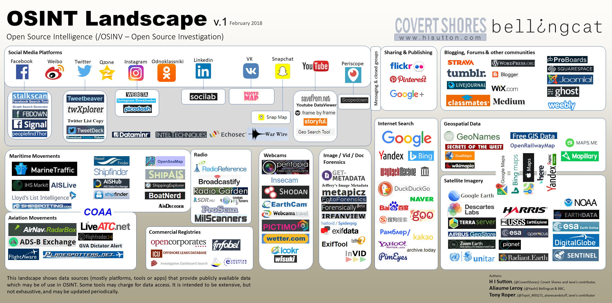

# OSINT для Нетсталкинга

Использование техник и приёмов [OSINT](https://ru.wikipedia.org/wiki/OSINT) для нетсталкинга: 
- Базовые знания
- Инструменты
- Гайды
- Реальные кейсы

> Разведка на основе открытых источников (англ. Open-source intelligence, OSINT) — одна из разведывательных дисциплин. Включает в себя поиск, выбор и сбор разведывательной информации, полученной из общедоступных источников, и её анализ.

## Оглавление

- [Ресурсы](#Ресурсы)
  - [На русском](#-На-русском)
  - [На английском](#-На-английском)
- [Статьи](#Статьи)
  - [Авторские статьи при поддержке Нетсталкинг Оверграунд и Точки Сбора](#-Авторские-статьи-при-поддержке-Нетсталкинг-Оверграунд-и-Точки-Сбора)
  - [На русском](#-На-русском-1)
  - [На английском](#-На-английском-1)
- [Инструменты](#Инструменты)
  - [ВКонтакте](#-ВКонтакте)
  - [Tor и .onion](#-tor-и-onion)
  - [Разное](#-Разное)
- [Другие подборки](#-Другие-подборки)
- [Другое](#-Другое)

## Ресурсы

### [↑](#Оглавление) На русском

- [Бизнес как разведка](http://hrazvedka.ru)

- [bellingcat. раследования, открытые для каждого](https://ru.bellingcat.com)

- [Mini Intelligence Team](http://minteam.pw/)

- [Чудеса OSINT](https://t.me/russianosint)

- [Пособие по журналистике данных](https://ria.ru/files/book/_site/index.html)

### [↑](#Оглавление) На английском

- [Автоматизация OSINT](http://www.automatingosint.com/blog/)

- [Различные кейсы и гайды](https://exposingtheinvisible.org/)

- [Книга о том, как проверять, использовать и преподносить информацию во время катастроф](http://verificationhandbook.com/)

- [bellingcat. the home of online investigations](https://www.bellingcat.com/)

- [The Data Journalsim Handbook](https://datajournalismhandbook.org/)

## Статьи

### [↑](#Оглавление) Авторские статьи при поддержке [Нетсталкинг Оверграунд](https://vk.com/netover) и [Точки Сбора](https://t.me/netstalking)

- [**Начальные знания**](http://telegra.ph/OSINT-chto-ehto-i-chem-nam-polezno-06-24)

- [Учимся работать с Maltego](http://telegra.ph/Maltego-priruchaem-12-29)

- _Серия пятиминутных кейсов от [CapyB](https://t.me/Capy_B):_

  - [Поиск программных инструментов](http://telegra.ph/Pyatiminutnyj-kejs-po-OSINT-1-01-16)
  
  - [Использование Google дорков](http://telegra.ph/Pyatiminutnyj-kejs-po-OSINT-2-01-16)
  
  - [Пробив человека](http://telegra.ph/Pyatiminutnyj-kejs-po-OSINT-3-03-12)
  
- [Дорки для нетсталкинга](http://telegra.ph/Dorki-dlya-netstalkinga-11-15)

- _Учимся работать с графами:_

  - [Визуализация данных OSINT](http://telegra.ph/Rabota-s-grafami-ch1-Vizualizaciya-dannyh-OSINT-04-28)
  
  - [Поведенческий анализ веб приложения](http://telegra.ph/Rabota-s-grafami-ch2-Povedencheskij-analiz-veb-prilozheniya-04-28)

- _Материалы, касающиеся финальных этапов OSINT (анализ, отчёт):_

  - [Майндмаппинг](http://telegra.ph/Majndmapping-Nashi-znaniya-samye-krasivye-07-15 )
  
  - [Диаграммы, схемы, графы](http://telegra.ph/Diagrammy-shemy-grafy-10-30)
  
- [Пример успешного выслеживания человека (по аккаунтам, ресурсам форумов и соцсетей, стилистике)](http://telegra.ph/Delo-Bogatova-Kto-takoj-Ajrat-Bashirov-05-02)

- [Пример использования аналитического и поискового софта в реальной нетсталкерской задаче](http://telegra.ph/Oni-vam-ne-novosti-04-16)

- [Сканирование онион-ресурсов](https://t.me/joinchat/AAAAAEmzkfIyn_sWn8oWNQ)

### [↑](#Оглавление) На русском

- [OSINT как метафора](https://kiwibyrd.org/2014/12/03/1415/)

- [Разбор кейсов из CTF](https://habrahabr.ru/post/338078/)

- [Как качественно "пробить" человека в Интернете](https://habrahabr.ru/company/echelon/blog/319334/)

- [Интернет-разведка в действии. Who is Mr./Ms. Habraman?](https://habrahabr.ru/company/echelon/blog/320270/)

- [Как «пробить» человека в Интернет: используем операторы Google и логику](https://habrahabr.ru/company/echelon/blog/321754/)

- [**Google дорки**](https://habrahabr.ru/post/283210/)

- [Анализ и визуализация эго-сети на примере аккаунта сети VKontakte с помощью Gephi](https://rcsoc.spbu.ru/v-pomoshch-polzovatelyam/433-gephi-analiz-i-vizualizatsiya-ego-seti-na-primere-akkaunta-vkontakte-vk-com.html)

- [Статьи от Джастина из bellingcat](https://ru.bellingcat.com/author/justin-seitz/)

- [Инструкция по определению даты публикации материала в интернете (также на сайте много интересного материала по отличию правды от фейков)](https://www.stopfake.org/kak-uznat-datu-publikatsii-materialov-v-internete/)

- _Статьи по ОСИНТу от [Вастрика](https://vas3k.ru):_

  - [Как найти аккаунты и личные данные человека в сети, инструменты для деанона по открытым источникам](http://vas3k.ru/blog/389/)
  
  - [Как определить монтаж на фото. Разоблачаем фейки, фотошоп и ретушь](http://vas3k.ru/blog/390/)
  
  - [Как найти место по фотографии и сгонять за заброшенный особняк](http://vas3k.ru/blog/388/)
  
- [Пул IP адресов жертвы](http://telegra.ph/YA-tvoj-IP-vychislyu-03-03)

### [↑](#Оглавление) На английском

- [Удаляем "следы" из сети с помощью OSINT техник](https://www.learnallthethings.net/blog/2018/1/23/opting-out-like-a-boss-the-osint-way)

- _Разведка и проникновение на корабли:_

  - [OSINT from ship satcoms](https://www.pentestpartners.com/security-blog/osint-from-ship-satcoms/)
  
  - [Tracking & hacking ships with Shodan & AIS](https://www.pentestpartners.com/security-blog/tracking-hacking-ships-with-shodan-ais/)
  
- [Находим геолокацию фотографии по отражению в стекле](http://blog.ioactive.com/2014/05/glass-reflections-in-pictures-osint.html)

- [Находим где сделана фотография и откуда (quiz от Philipp Dudek)](https://medium.com/@sector035/quiztime-the-one-that-got-me-started-5a522c76bc89)

- [Пост с детальным разбором поискового квеста, связанного с узнаванием места по фотографи](https://medium.com/@sector035/quiztime-february-28-2018-5a30deeaf4a6)

- [Как использовать CREST коллекцию от ЦРУ](http://www.thephora.net/forum/showthread.php?t=118095)

- [Гайд по использованию Inquisitor](https://penafieljlm.com/2017/07/14/inquisitor/#inquisitor)

- [Взлом криптомайнеров, используя техники OSINT](https://medium.com/@s3yfullah/hacking-cryptocurrency-miners-with-osint-techniques-677bbb3e0157)

## Инструменты

### [↑](#Оглавление) ВКонтакте

- [Аналог Скотобазы](http://bazaman.ru/)

- [Работающий аналог скотобазы, ищет фото загруженные пользователем в группы](http://poiskvk.org/)

- [Визуализация друзей ВКонтакте](https://www.yasiv.com/vk)

- [Скрытые друзья ВК и мониторинг активности](https://220vk.com/)

- [Универсальный набор инструментов для парсинга онлайн](https://vk.barkov.net/)

- _Упоминания в ВК (**ID** заменить на id пользователя) - https://vk.com/feed?obj=ID&q=&section=mentions_

### [↑](#Оглавление) Tor и .onion

- [.onion crawling](https://github.com/DedSecInside/TorBoT)

- [Clearnet поисковик по .onion сайтам](http://torscan.io/)

- _[Инструмент для исследования Tor-сети](https://github.com/s-rah/onionscan)_

  - [Гайд в 4 частях](https://github.com/BaltimoreChad/pyOnionScan)
  
  - [Краткая инструкция на русском](https://codeby.net/forum/threads/onionscan.60969/)

### [↑](#Оглавление) Разное

- [Трэкинг людей](https://github.com/boxug/trape)

- [OSINT'им видео](http://www.invid-project.eu/tools-and-services/invid-verification-plugin/)

- [Автоматизация OSINT'а, есть поддержа Телеграм](https://github.com/Te-k/harpoon)

- [Расширение браузера для быстрых заметок](https://mozgi.net/HowTo)

- [Поиск YouTube видео по какому-то конкретному городу](http://youtube.github.io/geo-search-tool/search.html)

- [Расширение для Burp Suite собирабщие информацию с LinkedIn по результатам поиск Google и Bing. Имеет удобный вывод в таблицу Excel](https://github.com/clr2of8/GatherContacts)

- [Флеш-инструмент составления и хранения карт связей между влиятельными людьми и компаниями](http://www.theyrule.net/)

- [Хеш finder (md5 и другие)](http://finder.insidepro.team/)

## [↑](#Оглавление) Другие подборки

- **[Документы найденные в netstalking_documents и от участников Точки Сбора](https://yadi.sk/d/kRpGIR6U3VgmeM)**

- [Awesome Osint](https://github.com/jivoi/awesome-osint)

- [Awesome Osint [2]](https://github.com/Ph055a/awesome_osint)

- 

- 

- [Links for OSINT](http://www.onstrat.com/osint/)

- [Список ресурсов которые испольует Bellingcat](https://docs.google.com/document/d/1BfLPJpRtyq4RFtHJoNpvWQjmGnyVkfE2HYoICKOGguA/edit#)

- [Перечень OSINT-софта, иногда даже бесплатного, которым можно заменить или дополнить Мальтегу](https://pastebin.com/gzELdhgG)

- [Обновленная подборка одного треда со старого форума](https://cryptpad.fr/pad/#/1/view/qigKGaKaCcaVWmUcVCb-6w/KOWWSMpbJwB4CuzPyh0jWIRy3S7MXGqXHiMI5WMMwUQ/)

- [Сайты для OSINT'а](https://midasearch.org/osint-websites/)

- [Различные сайты/инструменты, каждый с описанием](https://tomokodiscovery.com/free-tools-osint-socmint-dark-web-darknet-tor-bitcoin/)

- [Топ 100 инструментов для кибербезопасности](https://n0where.net/best-free-open-source-cybersecurity-tools)

- [Подборка других подборок :)](https://drive.google.com/drive/folders/0BwyWDQ59jRVGMFp3UnBfeUEzanM)

- [Бесплатные ресурсы](https://www.toddington.com/resources/)

## [↑](#Оглавление) Другое

- Инструменты, которые испольлузет [Bellingcat](https://www.bellingcat.com/):

- [Выступление на DEF CON 25, Recon Village по SkipTracing'у. Или OSINT людей для развлечения и денег](http://www.youtube.com/watch?feature=player_embedded&v=uBy2N0NmS2o)

- [Подкасты от Michael Bazzell (владелец inteltechniques.com) по конфиденциальности и безопасности в сети](https://inteltechniques.com/podcast.html)

